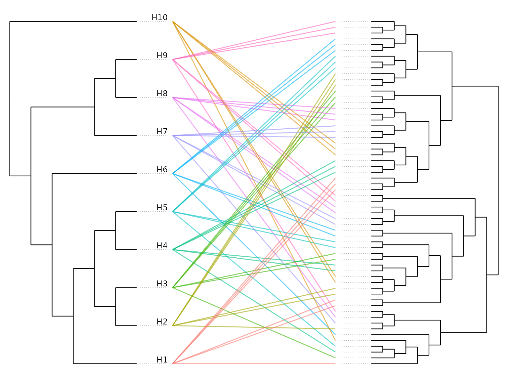

# Secondary analyses

Beyond the main scan, `codiv` provides functions for probing robustness,
dating co-diversification events, and visualizing host–symbiont
congruence. All build on a
[`codiv()`](https://www.sprockettlab.com/codiv/reference/codiv.md)
result, so they share its inputs and conventions.

``` r

library(codiv)
sim <- simulate_codiv_data(n_hosts = 10, n_clades = 3, seed = 1)
```

## Which hosts drive the signal? Leave-one-host-out

[`loo_host_analysis()`](https://www.sprockettlab.com/codiv/reference/loo_host_analysis.md)
reruns the scan with each host removed in turn and reports how much each
host changes the number of significant nodes — a large `impact_score`
means the host contributes disproportionately to the signal.

``` r

loo <- loo_host_analysis(sim$host_tree, sim$symbiont_tree, sim$links,
                         permutations = 99, methods = "hommola", verbose = FALSE)
loo$host_importance
#>    host n_nodes hommola_n_sig hommola_delta_n_sig hommola_mean_stat
#> 1   H10       3             1                   1        0.54966193
#> 2    H1       3             0                   0        0.04105333
#> 3    H4       3             0                   0       -0.05157533
#> 4    H5       4             0                   0       -0.35467909
#> 5    H6       5             0                   0       -0.03759277
#> 6    H7       5             0                   0       -0.12729746
#> 7    H9       5             0                   0       -0.03759274
#> 8    H8       5             0                   0       -0.12729746
#> 9    H2       4             0                   0       -0.40858650
#> 10   H3       4             0                   0       -0.14747430
#>    impact_score
#> 1             1
#> 2             0
#> 3             0
#> 4             0
#> 5             0
#> 6             0
#> 7             0
#> 8             0
#> 9             0
#> 10            0
```

## How sensitive are the results? Parameter sweeps

[`sensitivity_analysis()`](https://www.sprockettlab.com/codiv/reference/sensitivity_analysis.md)
reruns the scan across a grid of `span_fraction` and `min_symbiont_tips`
values so you can see whether findings are stable or
threshold-dependent.

``` r

sens <- sensitivity_analysis(sim$host_tree, sim$symbiont_tree, sim$links,
                             span_fraction_range = c(0.3, 0.6),
                             min_symbiont_tips_range = c(7, 10),
                             permutations = 99, methods = "hommola",
                             verbose = FALSE)
sens$sensitivity_data
#>   span_fraction min_symbiont_tips n_nodes hommola_n_sig hommola_mean_stat
#> 1           0.3                 7      10             0       -0.05226943
#> 2           0.6                 7      12             0       -0.03900951
#> 3           0.3                10       8             0        0.01857405
#> 4           0.6                10      10             0        0.02031726
```

## Dating co-diversification: the molecular clock

For strongly co-diversifying clades,
[`molecular_clock()`](https://www.sprockettlab.com/codiv/reference/molecular_clock.md)
regresses symbiont divergence against host clade age. A positive slope
corroborates that symbiont clades diversified alongside their hosts, and
the slope estimates the symbiont molecular rate (following [Sanders et
al. 2023](https://www.nature.com/articles/s41564-023-01388-w)).

``` r

clock_sim <- simulate_codiv_data(n_hosts = 14, clades = list(
  list(codiversifying = TRUE, congruence = 1, n_per_host = 3)), seed = 1)
codiv_results <- codiv(clock_sim$host_tree, clock_sim$symbiont_tree,
                       clock_sim$links, span_fraction = 0.9, methods = "hommola",
                       permutations = 199, verbose = FALSE)

# the simulated host tree is ultrametric, so it stands in for a time-calibrated tree
mc <- molecular_clock(codiv_results, clock_sim$host_tree, stat_threshold = 0.75)
mc$slope
#> [1] 1.010627
mc$r_squared
#> [1] 0.999948
head(mc$per_clade)
#>   Node_ID n_hosts  host_age symbiont_divergence
#> 1 Node_29       5 0.1622165           0.1642994
#> 2  Node_4       6 0.4981807           0.5164868
#> 3  Node_3       9 0.7521906           0.7612640
#> 4  Node_2      14 1.9897942           2.0152759
```

## Visualizing congruence: tanglegrams

[`plot_codiv_trees()`](https://www.sprockettlab.com/codiv/reference/plot_codiv_trees.md)
draws the host and symbiont trees face to face with a line for each
association — an intuitive read on how congruent they are. It returns a
`ggplot` object you can style or save with `ggsave()`.

``` r

plot_codiv_trees(sim$host_tree, sim$symbiont_tree, sim$links)
```



By default a cladogram layout is used and the symbiont tree is rotated
to reduce line crossings; set `use_branch_lengths = TRUE` to position
nodes by branch length, or pass a `codiv_results` object with
`color_by = "significance"` to highlight symbionts in significant
clades.
