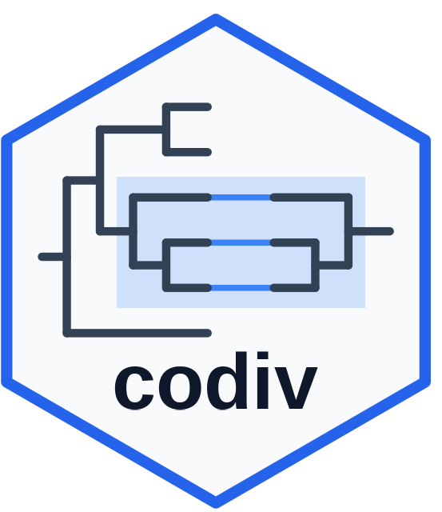

# codiv 

**Host–microbe codiversification analysis in R.**

`codiv` scans pairs of phylogenetic trees — a host tree and a symbiont tree — and asks, at every internal node of the symbiont tree, whether the symbionts' branching pattern mirrors their hosts'. Nodes where symbiont topology tracks host topology are evidence of **codiversification**: hosts and their microbes diversifying together.

## What it does

- **Multi-method node scan** (`codiv()`) — runs multiple statistical methods (Hommola's test, PACo, ParaFit, and a topology-only test) at every qualifying node to quantify the similarity between the host and symbiont trees, with per-node permutation p-values.
- **Rigorous scan-wide significance** (`codiv_null_scans()`) — a second-order permutation test that accounts for the phylogenetic non-independence of nested clades.
- **Interpretation & robustness** — leave-one-host-out analysis, parameter sensitivity sweeps, host-level summaries, a molecular-clock regression, and ggplot2 tanglegrams.
- **Ground-truth simulation** (`simulate_codiv_data()`) — generate host/symbiont datasets with known codiversification to validate and calibrate.

## Installation

```r
# install.packages("devtools")
devtools::install_github("SprockettLab/codiv")
```

## Quick example

```r
library(codiv)

# simulate a small dataset with known co-diversification
sim <- simulate_codiv_data(n_hosts = 12, n_clades = 20, seed = 1)

# scan every qualifying node of the symbiont tree
codiv_results <- codiv(sim$host_tree, sim$symbiont_tree, sim$links,
                       methods = "hommola", permutations = 99)

codiv_results            # compact overview: settings + significant nodes per method
summary(codiv_results)   # per-method statistic ranges and significant-node counts
```

The package ships the full rodent dataset from [Sprockett et al. (2025)](https://www.nature.com/articles/s41467-025-57435-z) in `inst/extdata`, so you can run a real scan immediately.

## Where to go next

- [**Getting Started**](articles/codiv.html) — the main tutorial.
- [**Simulation & validation**](articles/simulation-and-validation.html) — ground truth and false-discovery control.
- [**Secondary analyses**](articles/secondary-analyses.html) — robustness, dating, and visualization.
- [**Reference**](reference/index.html) — every user-facing function.

## Citation

If you use `codiv`, please cite:

> Sprockett, D. D., Dillard, B. A., Landers, A. A., Sanders, J. G., & Moeller, A. H. (2025). Recent genetic drift in the co-diversified gut bacterial symbionts of laboratory mice. *Nature Communications*. <https://doi.org/10.1038/s41467-025-57435-z>
